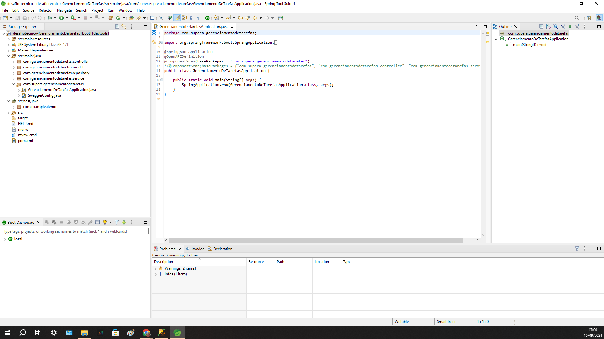

# Desafio Técnico Java – Supera

## Descrição
Este projeto consiste em um desafio técnico implementado em Java, abrangendo diferentes aspectos da programação, desde manipulação de strings e lógica matemática até o desenvolvimento de uma API RESTful. O desafio foi desenvolvido como parte de um processo seletivo e utilizam testes automatizados para validar as soluções.

## Estrutura do Projeto
O projeto é composto pelos seguintes diretórios e arquivos principais:

  - `gerenciamentodetarefas/`: Contém a implementação da API de Gerenciamento de Tarefas
    - `controllers/`
    - `models/`
    - `repositories/`
    - `services/`
    - `config/`


## Desafio Técnico: Gerenciamento de Tarefas (API RESTful)

### Classes Principais
- `TarefaController`: Gerencia as requisições HTTP relacionadas às tarefas.
- `ListaController`: Gerencia as requisições HTTP relacionadas às listas de tarefas.
- `Tarefa`: Modelo que representa uma tarefa.
- `Lista`: Modelo que representa uma lista de tarefas.
- `TarefaService`: Contém a lógica de negócio para manipulação de tarefas.
- `ListaService`: Contém a lógica de negócio para manipulação de listas.

### Funcionalidades
1. CRUD de listas de tarefas e itens individuais.
2. Priorização e destaque de itens.
3. Filtros e ordenação de tarefas.
4. Persistência de dados com SQL Server.

### Regras de Negócio
1. Uma tarefa deve pertencer a uma lista.
2. Tarefas podem ser marcadas como concluídas ou pendentes.
3. Listas podem conter múltiplas tarefas.
4. Tarefas destacadas têm prioridade na visualização.

## Testes Automatizados
Os testes automatizados estão localizados no diretório `src/test/java/` e utilizam JUnit para validar a implementação de cada desafio. Os testes cobrem diferentes cenários, incluindo:

- Validação de entradas
- Casos de uso típicos
- Casos de borda e exceções
- Para a API RESTful, testes de integração das operações CRUD

## Tecnologias Utilizadas
- Java
- Spring Boot (para o desafio de API RESTful)
- JUnit para testes unitários
- SQL Server (para persistência de dados no desafio de API)
- Swagger (para documentação da API)

## Configuração e Instalação
1. Clone o repositório:
   ```
   git clone https://github.com/seu-usuario/desafios-java-supera.git
   ```
2. Abra o projeto no Spring Tool Suite 4 (STS4)
3. Para o desafio de API RESTful:
   - Certifique-se de que todas as dependências Maven estão instaladas
   - Configure a conexão com o banco de dados SQL Server no arquivo `application.properties`
4. Execute cada desafio individualmente ou inicie a aplicação Spring Boot para o desafio de API

## Documentação da API (Desafio 4)
A documentação da API está disponível via Swagger UI:
1. Inicie a aplicação Spring Boot
2. Acesse `http://localhost:8080/swagger-ui.html` no seu navegador

### Ferramenta utilizada
. IDE - SpringToolSuite4,
. JAVA

<br>
<h1 align="center">
    
</h1>
